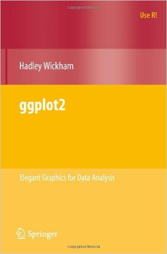

Homework 5
================

You are currently in the GitHub repository (repo) for `HW-5`. You must have completed all the steps in [Setting Up](https://rudeboybert.github.io/MATH216/jekyll/update/2016/09/12/getting-started.html).

Example: Data Visualization
---------------------------

-   In 1999, Leland Wilkinson wrote the "Grammar of Graphics", laying out the proposed grammar to build statistical visualizations **in the abstract** (i.e. not specific to any programming language).
-   In 2005, Hadley Wickham created the `ggplot2` package, which is an **implementation in R** of the grammar of graphics.

 

However, the grammar of graphics has been implemented elsewhere too

#### plotly

[plotly](https://plot.ly/) is a web interface for creating graphics using the grammar.

#### Tableau

Tableau is a **proprietary** (i.e. not open-source/free) software suite for data visualization.

In fact, Leland Wilkinson used to work at Tableau for many years, and his fingerprints are left all over it.

Homework
--------

-   Produce two visualizations in Tableau based on two (out of the three) Excel spreadsheets and submit these.
-   As your are working, try to identify where the various components of data visualization and data manipulation we've covered lie.
-   The bar for grading is low. This HW is really about exploration, not getting "right answers".

Learning Goals
--------------

-   Trying to emphasize: this is not a class on R; it is a class that uses R to implement bigger ideas.
-   The value of abstraction:
    -   Camera analogy
    -   Learning in the Liberal Arts
